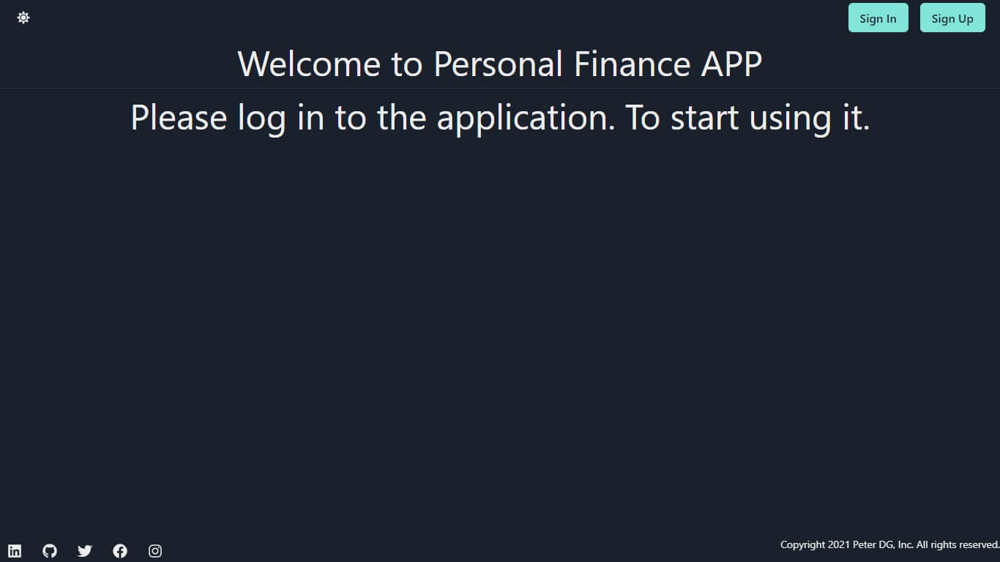
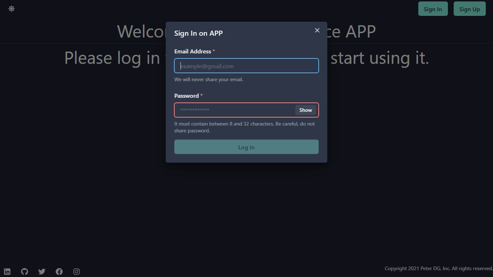
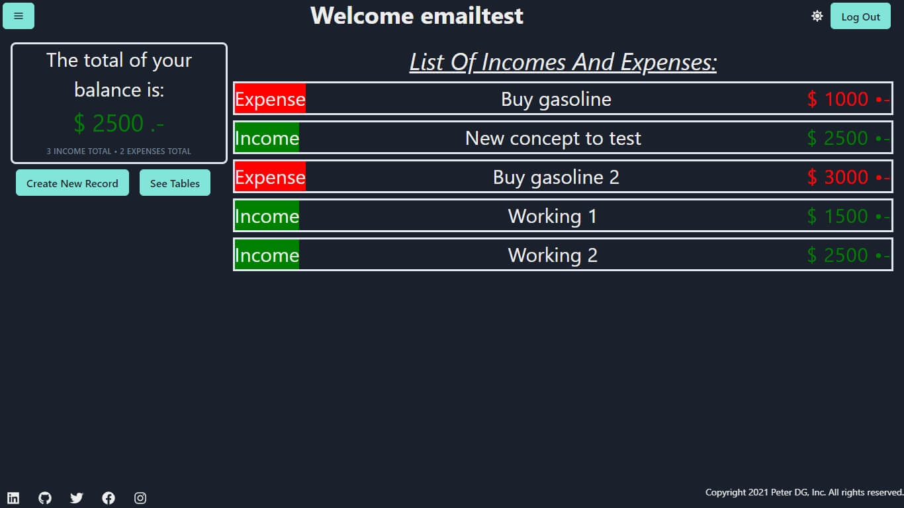
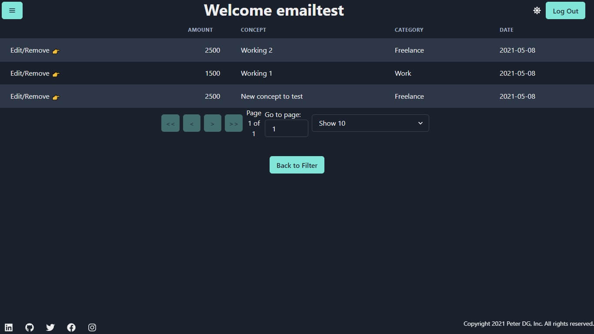
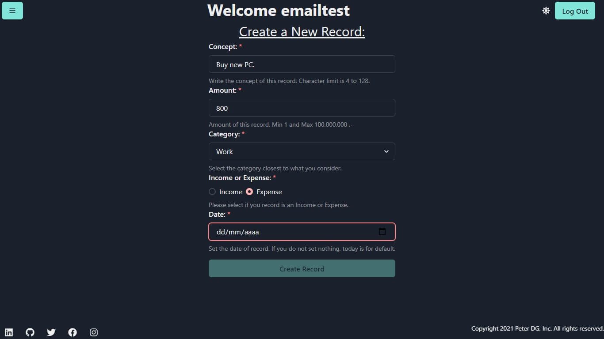
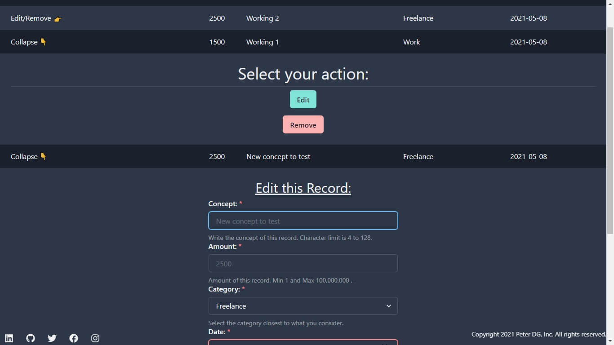

<h2 align="center">
  ChallengeJS 
  
</h2>

---

# Tabla de Contenido - Index

1. [¿Qué es esto?](#what)
2. [Instalar y Correr la Aplicación](#run)
3. [Scripts Disponibles de este contenedor](#scripts)
4. [Explicación en Profundidad](#deep)
5. [Imagenes del Proyecto](#img)
6. [Licencia](#license)

---

### ¿Qué es esto? 

En el marco de el desafío <b>"Challenge JS"</b> sobre Javascript propuesto por <b>Alkemy</b>.
Este es un contenedor para la APP, la API y pruebas e2e.

[Alkemy](https://www.alkemy.org/) - - - [Alkemy Challenges](https://www.alkemy.org/challenges)

El desafío elegido es el de <b>"Challenge JS"</b>, que puede observarse en la web de challenges o también en el siguiente archivo PDF:

[ChallengeJS - PDF](ChallengeJS.pdf)

---

## Instalar y Correr la Aplicación 

1. En tu consola favorita coloca:

`git clone https://github.com/PeterDamianG/challengejs-alkemy.git`

2. En el lugar donde lo hayas descargado, nos movemos al directorio:

`cd challengejs-alkemy`

3. El siguiente paso consiste en instalar todas las dependencias del desarrollo:

`npm run install-all`

<b>Anotación:</b> Serán descargadas en sus correspondiente lugar la parte del frontend, backend y cypress para el testeo e2e. Por esa razón este proceso puede llegar a demorar bastante.

4. Ahora necesitamos configurar el entorno, tanto para el backend como el frontend. Tienes dos opciones:

4.1 - Manualmente ir a la carpeta de <b>"frontend"</b> y la de <b>"backend"</b>. En ambas observaras un archivo <b>.env.example</b>. Basta con borrar la extensión <b>.example</b> y que el archivo quede como <b>.env</b> con ese alcanzaría.

4.2 - Automaticamente con el siguiente comando, podría no funcionar en todos los sistemas operativos. (No funcionara en una <b>Mac - Apple</b>):

`npm run fix-env`

<b>Nota:</b> Es recomendable entender para que sirven los archivos de entorno <b>.env</b>

5. El siguiente paso consiste en construir la aplicación de <b>React</b>, que servira de <b>frontend</b>. Con el siguiente comando:

`npm run build-app`

6. El último paso es levantar nuestra API, en modo de desarrollo:

`npm run start-dev`

La aplicación comenzara a funcionar en [LocalHost](http://localhost:3001/).

---

## Scripts Disponibles de este contenedor 

### npm run install-api

Se encarga de instalar todas las dependencias de la <b>API (BackEnd).</b> Es para uso interno, no debería ser necesario su llamado individual.

### npm run install-app

Se encarga de instalar todas las dependencias de la <b>APP (FronEnd).</b> Es para uso interno, no debería ser necesario su llamado individual.

### npm run install-all

Se encarga de instalar todas las dependencias de la <b>APP (FronEnd), API (BackEnd) y Cypress</b> de este contenedor. Es el comando que engloba todas las llamadas de instalación, es el que se debería usar normalmente.

### npm run fix-env-api

Se encarga de reemplazar el nombre del archivo de enterno en la <b>API</b>. Es para uso interno, no debería ser necesario su llamado individual.

### npm run fix-env-app

Se encarga de reemplazar el nombre del archivo de enterno en la <b>APP</b>. Es para uso interno, no debería ser necesario su llamado individual.

### npm run fix-env

Se encarga de llamar los comandos que reemplazan los archivos de entorno. Es el comando que se debería usar normalmente.

### npm run build-app

Se encarga de construir la aplicación en <b>React</b>, si vas a iniciar la aplicación como un TODO. Deberías usar este comando para construirla, pero no difiere de usar el comando original que se encuentra en el desarrollo del <b>FrontEnd.</b>

### npm start

Se levantara la <b>API</b>, que servira los estáticos generados con <b>React</b>. Usará el modo de producción de <b>Node</b>, <b>Prisma</b> y la base de datos <b>SQLite</b> también será la de producción. Estando en este modo, todo estara optimizado, pero el mal manejo de la base de datos puede generar grandes daños.

### npm run start-dev

Se levantara la <b>API</b>, que servira los estáticos generados con <b>React</b>. Usará el modo de desarrollo de <b>Node</b>, <b>Prisma</b> y la base de datos <b>SQLite</b> también será la de desarrollo. Básicamente usalo para el desarrollo.

### npm run start-test

Se levantara la <b>API</b>, que servira los estáticos generados con <b>React</b>. Usará el modo de pruebas de <b>Node</b>, <b>Prisma</b> y la base de datos <b>SQLite</b> también será la de pruebas. El uso recomendado es con <b>Cypress.</b> También se utiliza para las pruebas en el <b>BackEnd</b>.

### npm run cypress

Levantara el <b>test-runner</b> de <b>Cypress</b> en modo con cabecera. Es necesario que algunos de los <b>"start"</b>, estén actualmente corriendo. En caso de no ser la base de datos de pruebas, puede haber errores.

---

<b>Aclaración:</b> Los comandos mencionados previamente, sólo se constituyen a este parte del proyecto. El <b>BackEnd</b> y <b>FrontEnd</b>, respectivamente tienen sus propios comandos para funciones internas y externas. Como linters, pruebas y levantarse.

---

#### Explicación en Profundidad 

Este proyecto está constituido por dos partes principales y su contenedor.

El <b>FrontEnd</b>, construido con <b>React.</b> Que puede funcionar independientemente haciendo llamadas a una <b>API</b>. Puedes observar todo su desarrollo independiente en el folder <b>"frontend".</b>

El <b>BackEnd</b>, construido en <b>Express.</b> Que puede funcionar independiente proveyendo una <b>API</b> para que clientes usen, con un estilo similar a una <b>API REST</b>. Puedes observar todo su desarrollo independiente en el folder <b>"backend".</b>

Y por último este paquete TOP-LEVEL, que se encargara funcionar como un <b>WorkSpace.</b> Aprovechando su condición de empaquetador/contenedor/workspace, también se utiliza para realizar las pruebas <b>end to end.</b>

<b>PD:</b> Este "contenedor", se cambiara al nuevo sistemas de Workspaces provisto, en <b>NPM</b> versión 7 y superiores. <b>Proximamente.</b>

---

#### Imagenes del Proyecto Corriendo 

---

#### Aclaración pertinente

No se pretende, realizar un proyecto listo para producción, donde haya un coverage de testing de alto porcentaje. Un uso extensivo y profundo de caracteristicas de React como useMemo, useCallback y React.Memo, más que lo minimo necesario. Y tampoco el uso de la API Profiler.

El objectivo es general un MVP, un Producto Mínimo Viable que sirva como demostración.

---

##### Licencia 

[Licencia Github](LICENSE)
